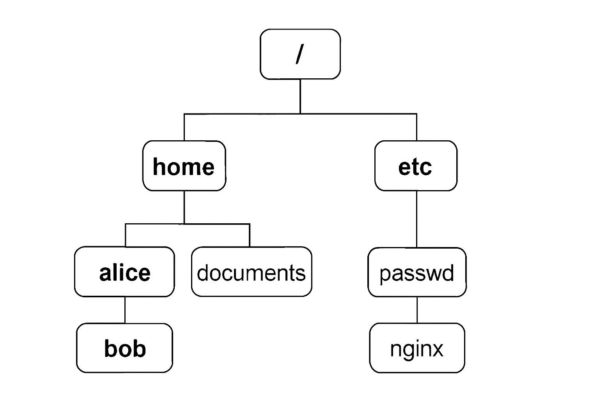

# 📂 Linux File Management & File Transfer Commands

This project covers essential Linux file operations and file transfer techniques. It's perfect for DevOps engineers, system admins, or anyone working on Linux.

---

## 🔐 File Management in Linux

### Common Tasks:
- Create/Delete files and directories
- Copy/Move files
- Search files
- Set file and folder permissions

📁 All related scripts are in the `file_management/` folder.

📷 Diagram:


---

## 🌐 File Transfer in Linux

### Tools & Commands:
- `scp`: Secure Copy
- `rsync`: Sync files and folders remotely
- `ftp/sftp`: File Transfer Protocol (Secure FTP)

📁 Practical examples are included in the `file_transfer/` folder.

📷 Diagram:


---

## 💡 Ideal For

✅ DevOps Engineers
✅ Cloud Admins
✅ Linux Enthusiasts
✅ College Students

---

## 🔧 How to Use

```bash
# Navigate to any script folder
cd file_management/

# Make the script executable
chmod +x create_delete.sh

# Run the script
./create_delete.sh

